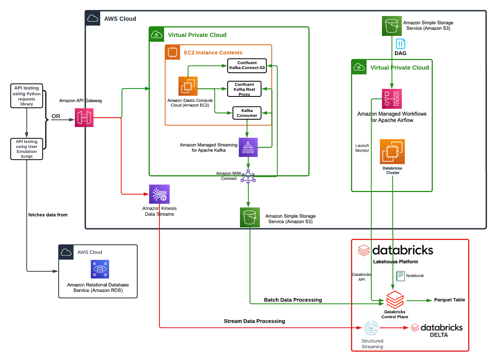

# Pinterest-Data-Pipeline

## Project Status

This project is currently being developed.

## Table of Contents

1. [Overview](#overview)
2. [Installation Instructions](#installation-instructions)
3. [Usage](#usage)
4. [File Structure](#file-structure)
5. [License](#license)

## Overview

A specialized project by AiCore; this initiative is designed to emulate industry-level skills. It involves creating a robust data pipeline for ingesting and processing pins, geolocation data, and user information using various AWS services. The pipeline utilises both batch and stream processing, culminating in the enhancement of analytical capabilities within Databricks. The final stage involves data cleaning and insertion into dedicated tables within the Databricks environment.

A diagram has been included below that gives a visual approach showing how this project will take place.



## Installation Instructions

> [!NOTE]
> Before you begin, make sure you have the following tools installed on your machine:
> - A source-code editor. (e.g. VS Code which can be installed from [here](https://code.visualstudio.com/download))
> - A package manager such as Conda. (Conda can be installed from [here](https://conda.io/projects/conda/en/latest/user-guide/install/index.html#regular-installation))
> - Git for performing the initial steps. (Git can be found [here](https://github.com/git-guides/install-git))

### 1. Clone the Repository

Clone the repository to your local machine using the following command in your terminal:

```bash
git clone https://github.com/CMD97/Pinterest-Data-Pipeline
```

### 2. Create and Activate the Conda Environment

Create the environment to house the dependencies required to run the application.
```bash
conda create --name pinterest-env
conda activate pinterest-env
```

### 3. Navigate to the Project Directory

Navigate to the directory so we're able to utilise the files inside.

```bash
cd Pinterest-Data-Pipeline
```

### 4. Install Dependencies

Finally, install the dependencies that are located within the requirements.txt file inside the directory.

```bash
conda install --file requirements.txt
```

## Usage

> [!NOTE]
> To proceed with the usage of this project you must have access to the following services:
> - Amazon Web Services (AWS)
> - Databricks Unified Analytics Platform
>
> Please note that these services may have associated costs. Ensure that you review the pricing details for [AWS](https://aws.amazon.com/pricing/) and [Databricks](https://databricks.com/pricing) to understand the pricing structure and potential charges based on your usage. It is the user's responsibility to manage and monitor costs associated with the usage of these services.

### Credentials Setup

The credentials utilised have been revoked to maintain security of the database, to be able to follow along you will need to create a YAML file that houses the credentials for the RDS database you will be extracting the data from, an example file can be seen below:

```yaml
HOST: [host_name]
USER: [username]
PASSWORD: [database_password]
DATABASE: [database_name]
PORT: 3306
```
> [!NOTE] These three tables must be present in the database to be able to run the application correctly:
> - pinterest_data
> - geolocation_data
> - user_data
>
> The columns within the tables are not shown here, however they can be found within the `user_posting-emulation.py` file.
> 
> If you are looking to use different tables, the `user_posting_emulation.py` file will need to be modified.

TEST

## File Structure

> Placeholder for the file structure to be added upon completion.

## License

This project is licensed under the MIT License - see the [LICENSE.md](LICENSE.md) file for details.
